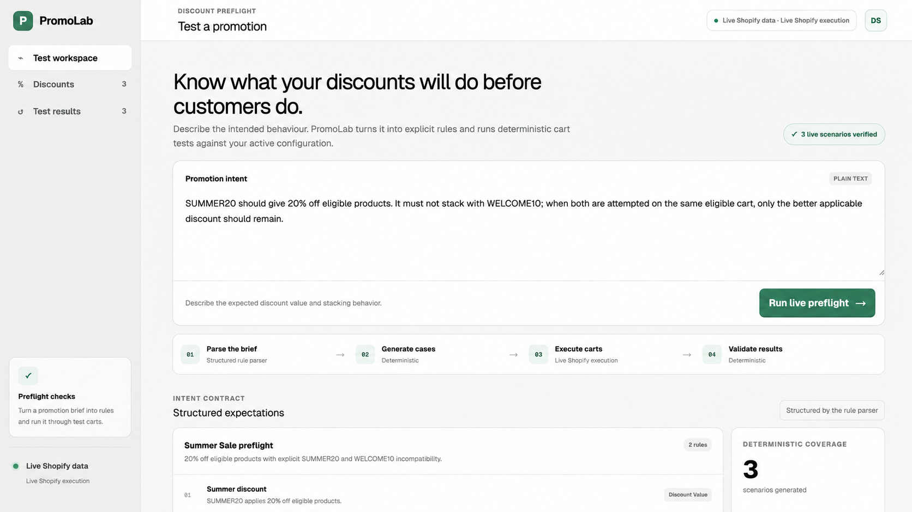
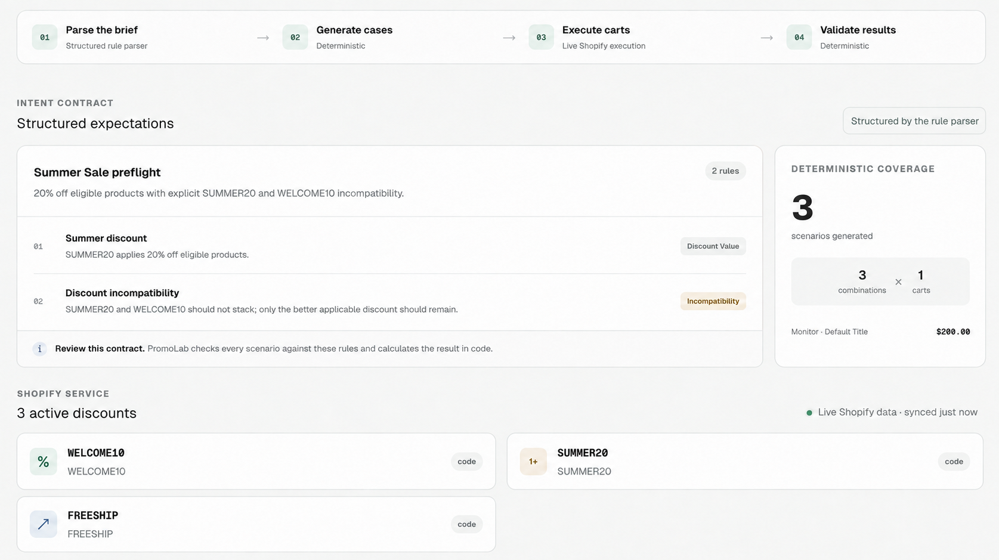
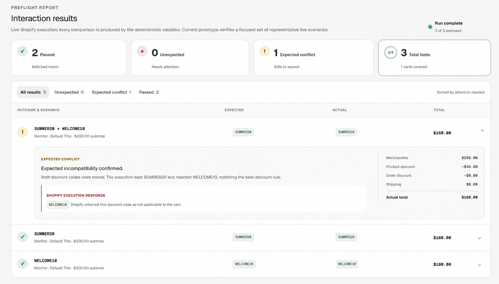

# PromoLab



> Preflight-test Shopify discount interactions before promotions go live.

PromoLab is a Shopify app designed to help merchants test promotion behaviour before it reaches customers. It turns a merchant's promotion brief into structured expectations, generates representative cart scenarios, executes discount combinations, and deterministically compares the expected and actual outcomes.

PromoLab is currently a local MVP. It can connect to a Shopify development store, but it is not publicly hosted or intended for production merchant use yet.

## Current MVP

- Reads active discounts, combination policies, products, and eligible variants from Shopify Admin.
- Normalizes Shopify's GraphQL responses before they reach the scenario engine or UI.
- Supports isolated mock data, simulated execution, and explicit live Storefront execution modes.
- Reuses one Shopify cart for multiple discount-code combinations on the same merchandise.
- Separates expected product, order, and shipping savings during deterministic validation.
- Reports passed scenarios, unexpected interactions, and expected conflicts with Shopify-calculated totals.

The focused live demo currently exercises `SUMMER20`, `WELCOME10`, and `SUMMER20 + WELCOME10` against one eligible merchandise cart. It does not claim exhaustive coverage of every cart or active discount.



_The promotion brief becomes a reviewable two-rule contract before any result is classified._

## APIs used

| API | What PromoLab uses it for |
| --- | --- |
| Shopify client-credentials token endpoint | Obtains an Admin access token on the server when live data mode is enabled. |
| Shopify Admin GraphQL API (`2026-07`) | Reads active discount configuration, combination policies, product eligibility, products, and variant IDs. Responses are normalized before the rest of PromoLab uses them. |
| Shopify Storefront GraphQL Cart API (`2026-07`) | Creates one real cart per distinct test-cart composition, applies complete discount-code combinations, and returns Shopify-calculated lines, allocations, subtotals, and totals. |

All three integrations are server-side. Mock mode uses local responses behind the same service boundaries and makes no Shopify requests. PromoLab does not currently call an LLM API; its structured rule parser is deterministic and prototype-focused.

## How it works

```text
Promotion brief
    ↓
Structured rule parser
    ↓
Normalized Shopify discounts and products
    ↓
Deterministic scenario generation
    ↓
Mock or live Shopify cart execution
    ↓
Deterministic validation
    ↓
Passed · Unexpected · Expected conflict
```

The application keeps Shopify-specific GraphQL shapes behind server-side services and maps them into small PromoLab models before the scenario engine or UI sees them.

### Correctness boundary

The parser is responsible only for structuring the merchant's intent. Scenario generation, Shopify execution normalization, and pass/fail classification remain deterministic. Replacing the prototype parser with an LLM later will not move test correctness into the model.

## Quick start

Requirements:

- Node.js 22.13 or newer
- npm

Install and run:

```bash
npm install
npm run dev
```

No environment file or Shopify credentials are required. Both runtime modes default to `mock`, using these sample discounts:

- `WELCOME10`
- `SUMMER20`
- `FREESHIP`
- `BUY2GET1`

Open the local URL printed by Vinext.

## Runtime modes

Shopify data retrieval and cart execution are configured independently:

| Data mode | Execution mode | Behavior |
| --- | --- | --- |
| `mock` | `mock` | Uses fixture discounts/products and simulated cart execution. This is the default. |
| `live` | `mock` | Reads real Admin data but labels all cart outcomes as simulated. Useful for checking normalization without claiming real execution. |
| `live` | `live` | Reads real Admin data and executes real Storefront carts after the user selects **Run live preflight**. |
| `mock` | `live` | Rejected at startup so mock product identifiers cannot reach Shopify Storefront. |

Live Storefront execution never runs merely because the page renders or refreshes. Mock execution may run automatically.

## Connecting a development store

Start from [.env.example](./.env.example) and put local values in a gitignored environment file. Never commit Shopify credentials.

For live Admin data with simulated execution:

```dotenv
SHOPIFY_DATA_MODE=live
SHOPIFY_EXECUTION_MODE=mock
SHOPIFY_SHOP=your-store.myshopify.com
SHOPIFY_CLIENT_ID=your-client-id
SHOPIFY_CLIENT_SECRET=your-client-secret
SHOPIFY_API_VERSION=2026-07
```

For live Admin data and live Storefront execution, also set:

```dotenv
SHOPIFY_EXECUTION_MODE=live
SHOPIFY_STOREFRONT_ACCESS_TOKEN=your-private-headless-storefront-token
```

The Shopify app needs Admin access to read discounts and products. Storefront merchandise must be active, available, and published to the Headless storefront sales channel. PromoLab surfaces rejected or unavailable merchandise instead of substituting mock results.

All credentials are read from server-only modules. No Shopify secret uses a public browser environment prefix.

## Live execution safeguards

- The Admin and Storefront clients use Shopify API version `2026-07` by default.
- Each distinct test-cart composition creates one Shopify cart.
- Discount-code combinations run sequentially against that cart with `cartDiscountCodesUpdate`; each update sends the complete replacement code list.
- Storefront throttling is retried with capped exponential backoff and jitter.
- GraphQL errors, cart user errors, warnings, missing lines, invalid variant GIDs, and zero-subtotal carts produce explicit diagnostics.
- Live failures never fall back to mock execution.
- Eligibility connections expose truncation warnings when Shopify reports more nested records than the prototype queried.



_Each scenario retains its own Shopify-calculated discount allocation, total, and deterministic validation result._

## Project structure

```text
app/
  page.tsx                         Initial server-rendered report
  api/preflight/route.ts           Explicit preflight execution endpoint

src/
  adapters/                        Intent parsing and mock execution
  components/PromoLabApp.tsx       Main application UI
  data/fixtures.ts                 Demo prompt, expectations, and mock carts
  engine/                          Scenario generation, execution orchestration, validation
  server/preflight.ts              Server-side runtime composition
  server/shopify/                  Admin service, mode selection, GraphQL operations
  server/shopify/storefront/       Live Storefront execution adapter and operations
  shopify/                         Normalized models, Shopify types, and response mappers

tests/                             Engine, mapper, service, Storefront, and runtime tests
```

Important boundaries:

- `src/server/shopify/service.ts` defines the common Shopify Admin service.
- `src/server/shopify/factory.ts` selects the mock or live data service.
- `src/server/preflight.ts` selects execution mode and wires the complete preflight.
- `src/shopify/mapper.ts` converts Admin GraphQL responses into normalized discounts and products.
- `src/shopify/storefront-mapper.ts` converts Storefront cart responses into execution results.
- `src/engine/validator.ts` is the deterministic correctness boundary.

## Technology

- TypeScript
- React 19 and Next-compatible Vinext
- Shopify Admin GraphQL API `2026-07`
- Shopify Storefront GraphQL Cart API `2026-07`
- Node.js test runner and ESLint

## Verification

```bash
npm test
npx tsc --noEmit
npm run lint
npm run build
```

The tests cover the deterministic engine, normalized discount categories and combination flags, Shopify union mapping, mock/live mode selection, Storefront cart reuse, sequential execution, throttling retries, response normalization, and failure diagnostics.

## Current limitations

- The structured parser is deterministic and prototype-focused; an LLM integration is not implemented.
- The live suite currently runs only `SUMMER20`, `WELCOME10`, and their combined incompatibility case.
- Live shipping-discount execution is not implemented.
- Storefront execution does not yet cover arbitrary cart compositions or every discount subtype.
- Results are held in browser memory for the current page session; there is no database or run history.
